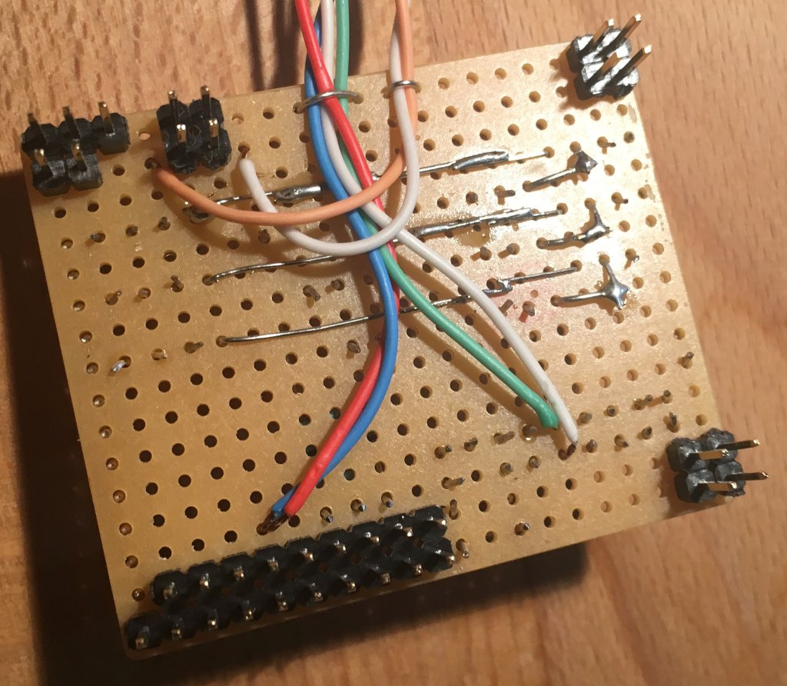

# c3noc-ip2radio

IP to web radio converter of the CCC NOC.
An audio-based connectivity monitor.

## Motivation

The C3NOC runs a conference network with thousands of clients for about a week
every year. We like to listen to electronic music while doing so. And we like to
monitor our uplink constantly. And we like to combine things in a silly way. We
have previously successfully combined switches and alcoholic drinks as well as
cyber squirrels and fiber-optic cables. Why not combine web radio and uplink
monitoring?

## Circuit

Have fun!

Dan Luedtke <mail@danrl.com>
